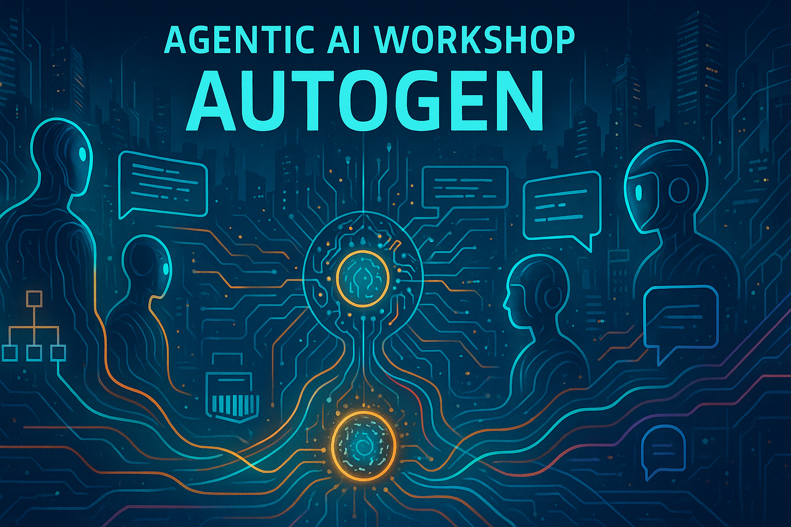

# 🚀 Agentic AI Workshop - AutoGen

A comprehensive workshop for exploring Microsoft AutoGen - the multi-agent conversational AI framework.

## 🎯 Workshop Overview

This workshop is designed to provide a deep dive into AutoGen, Microsoft's powerful framework for building multi-agent conversational AI systems. You'll learn how to create individual agents, build complex multi-agent systems, and integrate AutoGen with external tools and services.

## 📋 Prerequisites

- .NET 8.0 SDK or later
- Visual Studio Code or Visual Studio 2022
- Basic knowledge of C# programming
- OpenAI API key or Azure OpenAI Service access
- Git (for cloning repositories)

## 🚀 What is AutoGen?


AutoGen is a framework that enables the creation of applications using multiple AI agents that can converse with each other to solve tasks. It simplifies the orchestration of complex workflows by allowing agents to:

- Collaborate and communicate with each other
- Execute code and validate results
- Integrate with external tools and APIs
- Maintain conversation context and memory
- Support both chat-based and workflow-based interactions

### Key Features

- **Multi-Agent Conversations**: Create systems where multiple AI agents collaborate
- **Code Execution**: Built-in support for executing and validating code
- **Human-in-the-Loop**: Seamless integration of human feedback and oversight
- **Extensible**: Easy integration with external tools and APIs
- **Flexible**: Support for various LLM providers (OpenAI, Azure OpenAI, etc.)

## 🛠 Workshop Structure

### [Lab 01: Introduction to AutoGen](./src/lab01/README.md)
**Duration**: 45 minutes
- Understanding AutoGen basics
- Creating your first AI agent
- Basic conversation patterns
- Agent configuration and customization

### [Lab 02: Multi-Agent Systems](./src/lab02/README.md)
**Duration**: 60 minutes
- Building multi-agent conversations
- Agent roles and responsibilities
- Conversation flow control
- Advanced agent interactions

### [Lab 03: AutoGen Studio](./src/lab03/README.md)
**Duration**: 45 minutes
- Setting up AutoGen Studio
- Visual agent design
- No-code multi-agent workflows
- Studio configuration and customization

### [Lab 04: AutoGen and MCP Integration](./src/lab04/README.md)
**Duration**: 75 minutes
- Understanding Model Context Protocol (MCP)
- Integrating AutoGen with GitHub MCP server
- Code-based MCP integration
- Studio-based MCP configuration

## 🎓 Learning Objectives

By the end of this workshop, you will be able to:

1. **Create and configure individual AutoGen agents**
2. **Design and implement multi-agent conversational systems**
3. **Use AutoGen Studio for visual agent development**
4. **Integrate external tools and services using MCP**
5. **Understand best practices for agent design and deployment**
6. **Debug and troubleshoot agent interactions**

## 📚 Resources for Deeper Learning

### Official Documentation
- [AutoGen Documentation](https://microsoft.github.io/autogen/)
- [AutoGen GitHub Repository](https://github.com/microsoft/autogen)
- [AutoGen Studio Documentation](https://microsoft.github.io/autogen/docs/tutorial/code-executors)

### Research Papers
- [AutoGen: Enabling Next-Gen LLM Applications via Multi-Agent Conversation](https://arxiv.org/abs/2308.08155)
- [Multi-Agent Conversation Framework](https://www.microsoft.com/en-us/research/publication/autogen-enabling-next-gen-llm-applications-via-multi-agent-conversation/)

### Community Resources
- [AutoGen Discord Community](https://discord.gg/pAbnFJrkgZ)
- [AutoGen Examples Repository](https://github.com/microsoft/autogen/tree/main/notebook)
- [YouTube Tutorials](https://www.youtube.com/results?search_query=microsoft+autogen+tutorial)

### Related Technologies
- [Model Context Protocol (MCP)](https://modelcontextprotocol.io/)
- [OpenAI API Documentation](https://platform.openai.com/docs)
- [Azure OpenAI Service](https://azure.microsoft.com/en-us/products/ai-services/openai-service)

## 🔧 Setup Instructions

### 1. Clone the Repository
```bash
git clone https://github.com/your-username/AgenticWorkshop-AutoGen.git
cd AgenticWorkshop-AutoGen
```

### 2. Install .NET SDK
Download and install the latest .NET 8.0 SDK from [dotnet.microsoft.com](https://dotnet.microsoft.com/download)

### 3. Set Up API Keys
Create a `.env` file in the root directory:
```
OPENAI_API_KEY=your_openai_api_key_here
AZURE_OPENAI_ENDPOINT=your_azure_openai_endpoint
AZURE_OPENAI_API_KEY=your_azure_openai_key
```

### 4. Verify Installation
```bash
dotnet --version
```

## 🏃‍♂️ Quick Start

1. Navigate to Lab 01:
   ```bash
   cd src/lab01
   ```

2. Restore dependencies:
   ```bash
   dotnet restore
   ```

3. Run the first example:
   ```bash
   dotnet run
   ```

## 📖 Workshop Flow

1. **Start with Lab 01** to understand AutoGen fundamentals
2. **Progress to Lab 02** for multi-agent system development
3. **Explore Lab 03** for visual development with AutoGen Studio
4. **Complete Lab 04** for advanced integrations with MCP

Each lab builds upon the previous one, so it's recommended to follow the sequential order.

## 🤝 Contributing

We welcome contributions to improve this workshop! Please:

1. Fork the repository
2. Create a feature branch
3. Make your changes
4. Submit a pull request

## 📝 License

This workshop is licensed under the MIT License. See [LICENSE](LICENSE) for details.

## 🆘 Support

If you encounter any issues during the workshop:

1. Check the troubleshooting section in each lab's README
2. Review the common issues in the [FAQ](./FAQ.md)
3. Open an issue on GitHub
4. Join the AutoGen Discord community for help

## 🎉 Acknowledgments

Special thanks to the Microsoft AutoGen team for creating this amazing framework and the community contributors who have helped improve this workshop.

---

**Happy Learning!** 🚀

*Last updated: July 2025*
